# Nordic Testing Days Workshop

Time: 13:30 - 15:30 EEST (GMT+3), June 3rd, 2022 - https://sched.co/zanV

### Attendee Preconditions:
- Laptop that can run Kubernetes
- GitHub account with possibility to create public repositories

### Tools that will be installed on local machine during the workshop

If you want to get ahead of things you can install
- Docker / Kubernetes / Kubectl to set up a local k8s cluster
  - Optional: Google Cloud CLI if you want to use our provided cluster instead
- Cypress
- Postman
- In local cluster:
  - Petstore sample app
  - Testkube
  
## Workshop Steps 

### 1. Install Kubernetes (Minikube or Kind?)

- Install Docker
- Install Kubernetes - one of:
  - Minikube: download / install from https://minikube.sigs.k8s.io/docs/start/
  - Kind: https://kind.sigs.k8s.io/docs/user/quick-start/#installation
  - Docker: enable Kubernetes ?
- Install kubectl: https://kubernetes.io/docs/tasks/tools/
- Test installation with kubectl commands:

```
kubectl get all
kubectl get all -n kube-system
```

(as long as you don't get any errors - output will vary)

#### Backup if you can't install Kubernetes

You can use our temporary cluster instead - but you will still need to install kubectl and the Google Cloud CLI
- Install kubectl from https://kubernetes.io/docs/tasks/tools/
- Install Google Cloud CLI from https://cloud.google.com/sdk/docs/install
- Download provided kubeconfig at ... to `~/.kube/config`
- Replace `PATHTOGOOGLECLOUDSDK` in the downloaded file with the path where you installed the gcloud SDK 
- Test installation with same kubectl commands as above

#### If you can't install either Kubernetes or Kubectl/Google Cloud CLI then skip this step!

### 2. Install Demo Application in local cluster 

Steps:
1. Apply petstore deployment to your local cluster:

```
kubectl apply -f petstore-deployment.yaml
```

You should see a success message... now run

```
kubectl get all
```

which should eventually show the deployed petstore service (could take a while):

```
NAME                            READY   STATUS    RESTARTS   AGE
pod/petstore-749fbb9656-6mp7z   1/1     Running   0          17h
pod/petstore-749fbb9656-g9f69   1/1     Running   0          17h
pod/petstore-749fbb9656-tbkxb   1/1     Running   0          17h

NAME                 TYPE        CLUSTER-IP      EXTERNAL-IP   PORT(S)   AGE
service/petstore     ClusterIP   10.15.247.121   <none>        80/TCP    17h

NAME                       READY   UP-TO-DATE   AVAILABLE   AGE
deployment.apps/petstore   3/3     3            3           17h

NAME                                  DESIRED   CURRENT   READY   AGE
replicaset.apps/petstore-749fbb9656   3         3         3       17h
```

2. Set up port-forwarding and access through browser / CURL locally

You now have petstore running in local kubernetes cluster - run the following command to 
expose it from your cluster so you can access it through your browser:

```
kubectl port-forward deployment/petstore 8888:8080
..
Forwarding from 127.0.0.1:8888 -> 8080
Forwarding from [::1]:8888 -> 8080
```

Open your browser and point it to http://localhost:8888 - you should see the Swagger-UI

#### Backup - if you weren't able to install Petstore locally: 

Use [hosted Petstore](https://petstore.testkube.io/) instead - you should see the same Petstore as above.

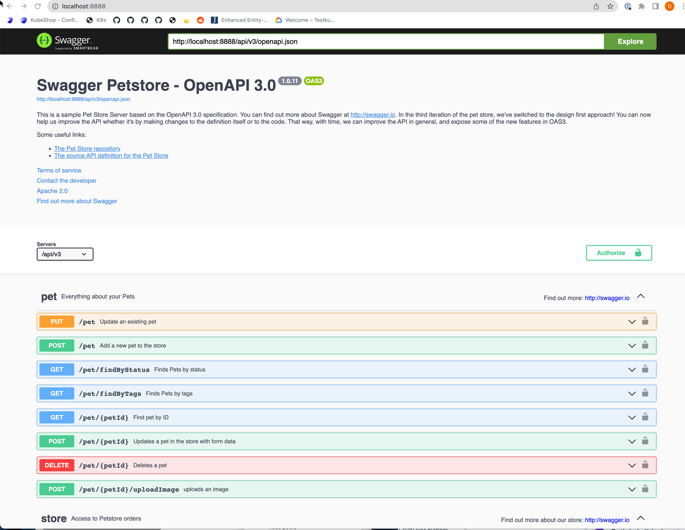

**Backup**: access demo petstore in hosted cluster

### 3. Install Cypress & Create tests 

Steps:
1. Download and install from cypress.io
2. Create empty folder for tests
3. Create new project for the empty folder
4. Delete sample tests
5. Create a new test named "petstore.spec.js"
6. Open that file in your IDE and replace its contents with the following:
```javascript
describe('Petstore Testing', () => {
    it('Visits PetStore', () => {
        cy.visit('http://localhost:8888/')
        // cy.visit('https://petstore.testkube.io/') - uncomment if using public petstore
        cy.get('.title').should('contain.text', "Swagger Petstore - OpenAPI 3.0")
    })
})
```

8. Run test in Cypress runner
9. Add some more assertions / actions to test
10. Add a package.json file to your local folder containing the following (required by Testkube):
```json
{
  "name": "cypress-petstore-test",
  "version": "1.0.0",
  "description": "",
  "main": "petstore.spec.js",
  "scripts": {
    "test": "cypress run petstore.spec.js"
  },
  "author": "",
  "license": "ISC",
  "devDependencies": {
    "cypress": "^8.5.0"
  }
}
```
11. (Push to a public github repo if possible)

#### Backup : watch the live demo!

Precreated Cypress tests for hosted petstore are available in [cypress folder](cypress)

### 4. Install Postman & Create API Tests 

Steps:

1. Install and run Postman Desktop app
2. Create empty workspace
3. Import PetStore OpenAPI def from https://petstore.testkube.io/api/v3/openapi.json
4. Set collection-level baseUrl variable to the endpoint of your local service - or to the hosted petstore url `https://petstore.testkube.io/api/v3`
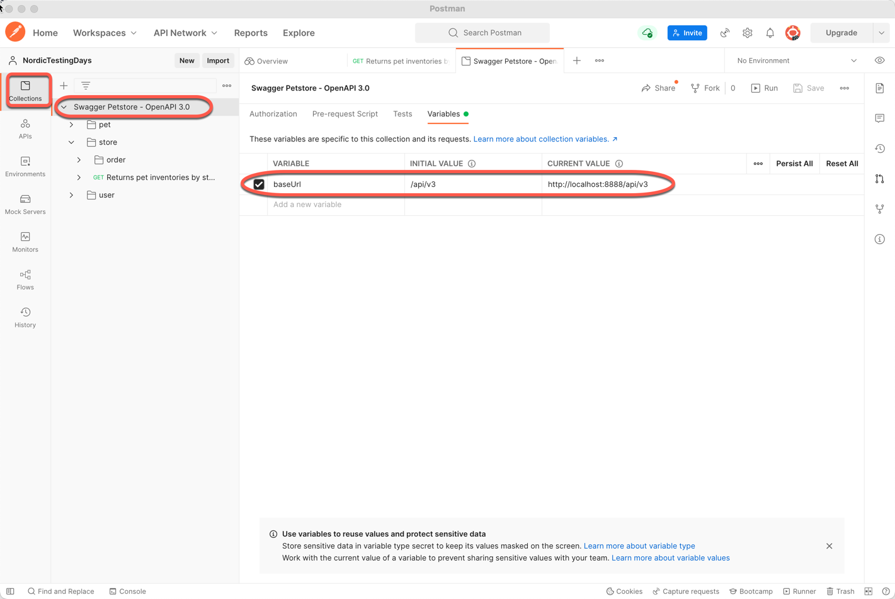
5. Execute GET store/inventory operation, make sure you get a response
6. Create simple test for inventory response - add test script that validates the approved property:
```javascript
pm.test("My first test", function () {
    var jsonData = pm.response.json();
    pm.expect(jsonData.approved).to.eql(50);
});
```
7. Run operation to see that test passes
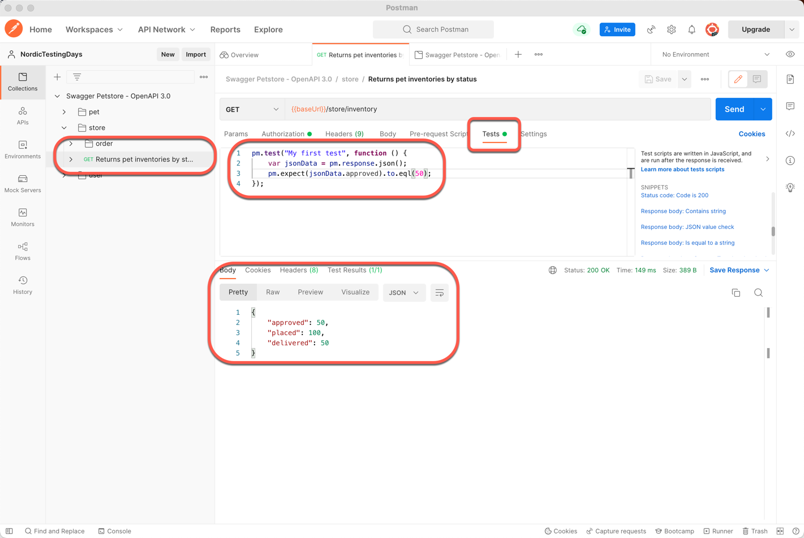
8. Remove all other operations from collection so only the inventory is left
9. Export collection to local file

#### Backup : watch the live demo!

Precreated Postman tests for hosted Petstore API are available in [postman folder](postman)

### 5. Install Testkube or access hosted Testkube

We'll start with a short overview of Testkube and will show the hosted dashboard.

Steps:
1. Install Testkube - https://kubeshop.github.io/testkube/installing/
2. Run `kubectl testkube version` to validate installation / access
```shell
➜  dev kubectl testkube version

████████ ███████ ███████ ████████ ██   ██ ██    ██ ██████  ███████
   ██    ██      ██         ██    ██  ██  ██    ██ ██   ██ ██
   ██    █████   ███████    ██    █████   ██    ██ ██████  █████
   ██    ██           ██    ██    ██  ██  ██    ██ ██   ██ ██
   ██    ███████ ███████    ██    ██   ██  ██████  ██████  ███████
                                           /tɛst kjub/ by Kubeshop


Client Version 1.2.7
Server Version v1.2.6
Commit
Built by Homebrew
Build date
➜  dev
```
3. Access Testkube dashboard locally using `kubectl testkube dashboard` command:
```shell
➜  dev kubectl testkube dashboard

The dashboard is accessible here: http://localhost:8080/apiEndpoint?apiEndpoint=localhost:8088/v1 🥇
The API is accessible here: http://localhost:8088/v1/info 🥇
Port forwarding is started for the test results endpoint, hit Ctrl+c (or Cmd+c) to stop 🥇
```

#### Backup: use hosted cluster

Go to Testkube dashboard at https://workshop.testkube.io

### 6. Add Tests to Testkube with UI

Steps:
1. Add exported Postman collection as test in dashboard 
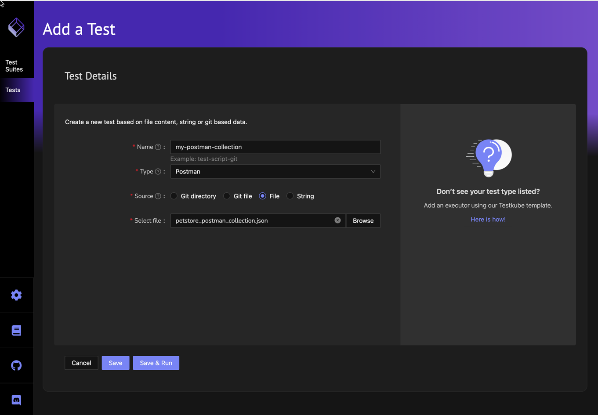
You should see the added test in the list of tests
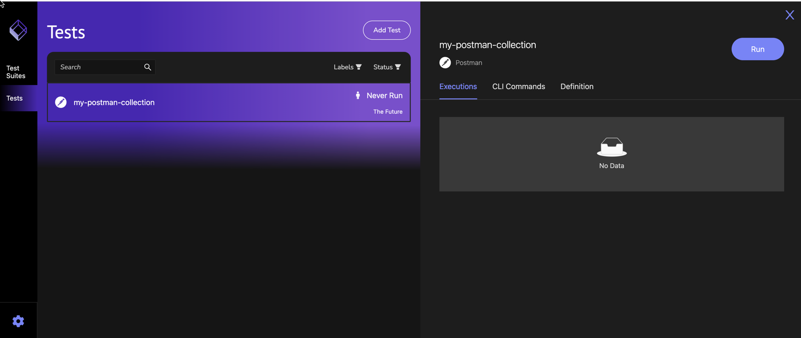
2. Add Cypress test from Git repository in dashboard
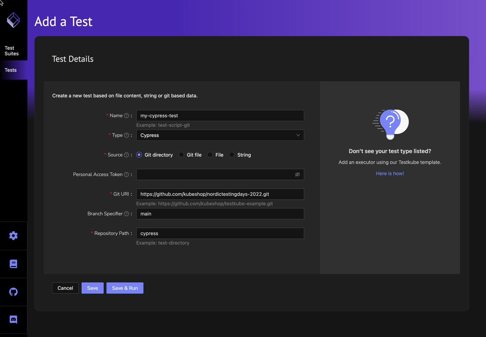
You should see the added test in the list of tests
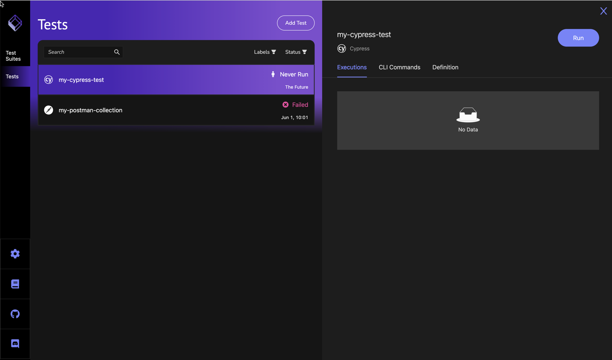

#### Backup: Create tests in hosted cluster

Same as above but use hosted dashboard instead
- You can use the provided Cypress / Postman tests if you weren't able to create these locally
- Be sure to use unique names for the created tests since other attendees might be doing the same!

### 7. Run Tests with Testkube through UI or CLI

Steps:
1. Run Tests in local Testkube using Dashboard or CLI and see results in Dashboard
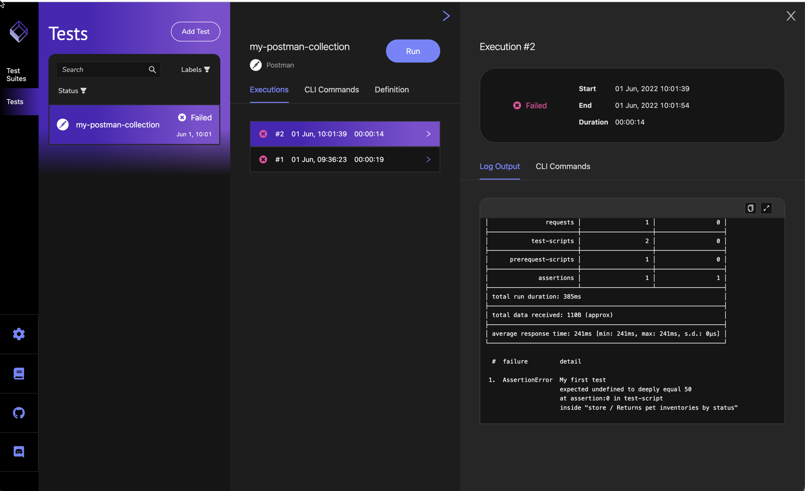
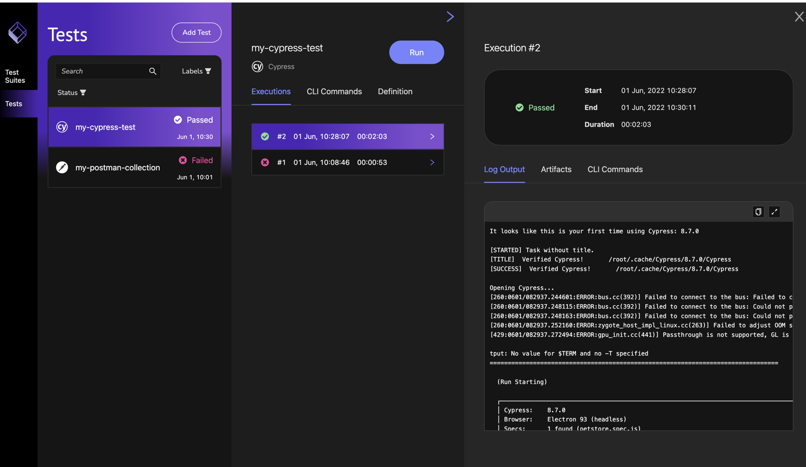

#### Backup 

- Run provided tests using either CLI or UI in hosted cluster

### 8. Create & Run TestSuite containing both API and UI tests

This step requires a working CLI since Testsuites can't yet be created using the UI. Our Testsuite will 
run both above created tests in sequence with a 1 second paused in between:

```json
{
  "name": "workshop-testkube-testsuite",
  "description": "Sample Testkube Testsuite",
  "steps": [
    {
      "execute": {
        "name": "my-postman-collection"
      }
    },
    {
      "delay": {
        "duration": 1000
      }
    },
    {
      "execute": {
        "name": "my-cypress-test"
      }
    }
  ]
}
```

See provided [testsuite.json](testsuite/testsuite.json) file.

Steps:
1. Create TestSuite using CLI - save the above to a file and pass it to `kubectl testkube create testsuite`:
```
cat testsuite/testsuite.json | kubectl testkube create testsuite --name workshop-testkube-testsuite
TestSuite created workshop-testkube-testsuite 🥇
```

You should now see the created Testsuite in the UI:
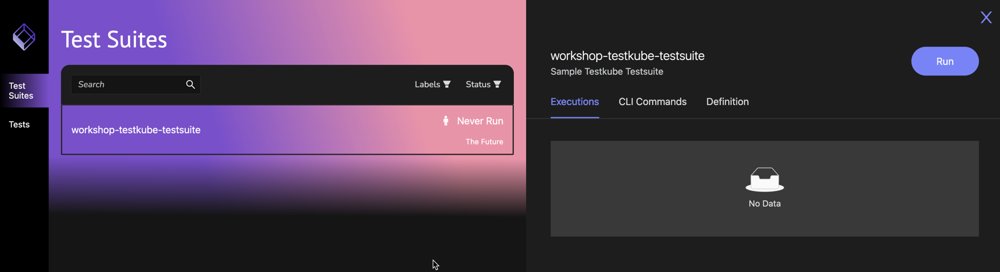

2. Run TestSuite through dashboard or CLI and see results:
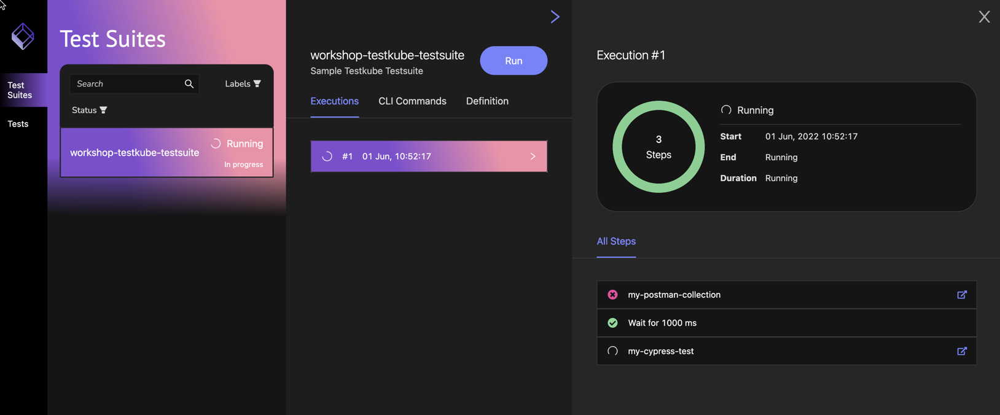

#### Backup 

- Run provided Testsuite in hosted cluster using dashboard UI

### 9. Schedule test execution from CI/CD - GitHub Action ?

Steps: 
- Watch demo using GitHub repo and hosted Testkube

### 10. Bonus: Add a Loadtest with k6

Steps:
1. Create test for provided k6 script in repository
2. Run test using dashboard or CLI
3. See results


